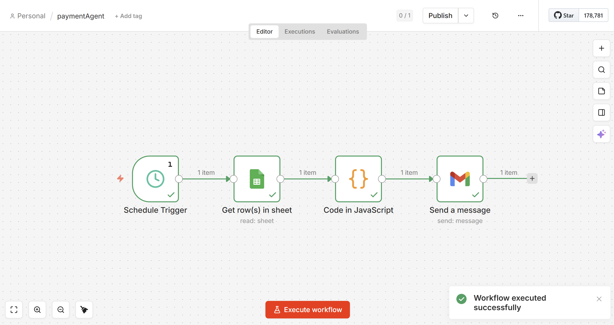

# Email Reminder Automation

This project is an automated email reminder system built using n8n.

## How it works

1. A scheduled trigger runs daily.
2. The workflow reads rows from a Google Sheet.
3. A JavaScript node filters rows where the payment date matches today's date.
4. If a match is found, an email reminder is sent automatically using Gmail.

## Workflow Architecture

This automation workflow was built using n8n.

The workflow runs daily and performs the following steps:

1. Scheduled trigger starts the workflow.
2. Google Sheets node reads payment records.
3. JavaScript node filters rows where payment date equals today's date.
4. Gmail node sends automated reminder emails.

## Technologies Used

- n8n
- Google Sheets API
- Gmail API
- JavaScript

## Use Case

Automates payment reminders so users don't have to manually track due dates.

